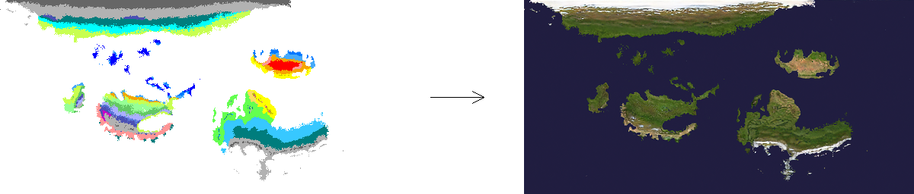

<center>

[](https://www.youtube.com/watch?v=LRvyi1xlMyY)

</br>
</center>

# ML-TerrainGeneration-Torch

TerrainML is a personal development project to synthesize realistic map images using Koppenmap inputs.
This custom pytorch implementation of semantic-based image synthesis is based on the paper Semantic Image Synthesis via Diffusion Models[1] and Improved denoising diffusion probabilistic models[4].


For our training data, we use KoppenGeiger climate classification maps[2][3] as semantic labels and 
satellite images from Nasa[5][6].
Combined we create a large-scale image that can use to train a semantic image generation model. This is possible due to both images being projected in Equirectangular projection. This causes our pixel data for our koppenmap to be in the same position as our satellite map.
Using this approach we can randomly crop parts of the data to use for our model.

## Examples

<center>




<video width="512" height="256" controls>
  <source src="Assets/GeneratedVideo.mp4" type="video/mp4">
</video>
</center>

## Training Data
for this model we use the following images as training data:

| Data | Link | Comment |
|---|---| --- |
| KoppenMapv1[2] | [Link](https://commons.wikimedia.org/wiki/File:K%C3%B6ppen-Geiger_Climate_Classification_Map_(1980%E2%80%932016)_no_borders.png)  | - |
| KoppenMapv2[3] | [Link](https://www.gloh2o.org/koppen/)  | Available in geotiff only. wil require convertion to visual format |
| Satellite Map[5]| [Link](https://visibleearth.nasa.gov/images/57752/blue-marble-land-surface-shallow-water-and-shaded-topography/57756l) | - |

## Setup

- To setup conda environment use the following command
```
conda env create -f environment.yml
```

- Before training run the setup script to prepare the data
```
python Setup.py  --Tolerance --KoppenPath --OutputPath
```

## How to Train

- To train the model run the Train.py script. all parser variables can be seen below.

```
python Train.py --ModelDir --ModelName --DataDir --Device --BatchSize --LearningRate --LRDecay --Lambda --TrainEpoch --WeightDecay --EmaRate --DataDropRate --DataDropDelay --LogInterval --SaveInterval --DataImageSize --DataZooming --MaxZooming --DataSpacing --DataWorkers --ValSplit --TimeSteps --NoiseSchedule --ModelType --ImageSize --ConditionalClasses --TimeDims --Channels --ResBlocks --AttentionThreshhold
```

## How to Sample

To generate new images using TerrainML one should put custom Koppenmaps into the input folder.
All images from this folder are used to generate maps which can be found in the output folder.

To create custom koppenmaps it is advised to create a colour pallete in image editing software of your choice and use this pallete for painting new maps.

- To sample run the Sample.py script. all parser variables can be seen below.

```
python Sample.py --ModelDir --ModelName --ModelVersion --Device --CFGScale --SaveIntermediate --SaveVideo --ImageSize --Samples
```

## Credits

- [1] : W. Wang et al., “Semantic image synthesis via diffusion models,” arXiv (Cornell University), Jan. 2022, doi: 10.48550/arxiv.2207.00050.
- [2] : H. E. Beck, N. E. Zimmermann, T. R. McVicar, N. Vergopolan, A. Berg, and E. F. Wood, “Present and future Köppen-Geiger climate classification maps at 1-km resolution,” Scientific Data, vol. 5, no. 1, Oct. 2018, doi: 10.1038/sdata.2018.214.
- [3] : H. E. Beck et al., “High-resolution (1 km) Köppen-Geiger maps for 1901–2099 based on constrained CMIP6 projections,” Scientific Data, vol. 10, no. 1, Oct. 2023, doi: 10.1038/s41597-023-02549-6.
- [4] : A. Q. Nichol and P. Dhariwal, “Improved denoising diffusion probabilistic models,” arXiv (Cornell University), Jan. 2021, doi: 10.48550/arxiv.2102.09672.
- [5] : https://visibleearth.nasa.gov/images/57752/blue-marble-land-surface-shallow-water-and-shaded-topography/57754l
- [6] : https://visibleearth.nasa.gov/
- [7] : https://youtu.be/TBCRlnwJtZU?feature=shared
- [8] : https://youtu.be/aw3H-wPuRcw?feature=shared
- [9] : https://github.com/hojonathanho/diffusion/blob/1e0dceb3b3495bbe19116a5e1b3596cd0706c543/diffusion_tf/utils.py

